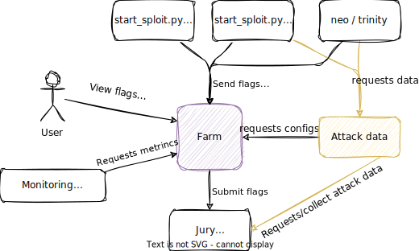
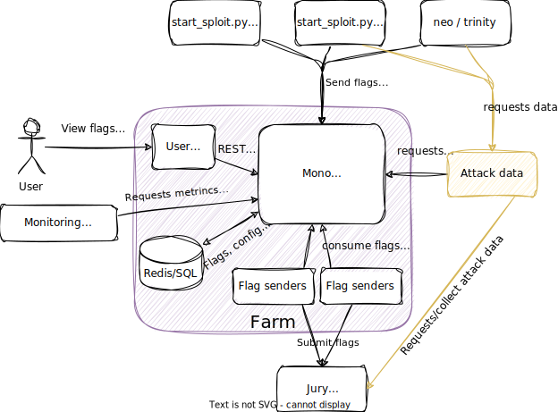

# Архитектура  <!-- omit in toc -->

- [Контекст системы](#контекст-системы)
- [Компоненты системы](#компоненты-системы)
  - [Flag flow](#flag-flow)
- [Сервисы](#сервисы)
  - [Mono-backend](#mono-backend)
    - [Config Domain](#config-domain)
    - [Flags Domain](#flags-domain)
    - [Sending Domain](#sending-domain)
    - [Metrics collector](#metrics-collector)
  - [Flag-sender](#flag-sender)

> Фиолетовый - рассматриваемая система  
> Белый - внешние компоненты  
> Жёлтый - внешние компоненты, реализующие часть логики системы

## Контекст системы

Ферма - сервис команды для автоматизированной и централизованной отправки флагов.  
Агрегирует в себе информацию о том куда и как сдавать, какой формат флага и историю сдачи флагов.  

Непосредственные пользователи системы - игроки. Их потребности:
- смотреть какие и сколько флагов сдано
- смотреть какие сплоиты приносят сколько флагов
- менять конфигурацию атак (например, состав противников)
- менять конфигурацию сдачи (например, лимиты сдачи флагов, токены доступа)

Клиентами фермы являются сплоиты, ворующие флаги. Для их работы требуется:
1. как минимум:
   - список и адреса противников
   - формат флага
2. опционально (реализуется за счёт внешнего сервиса):
   - атак дата
   - кэш кредов

Для целей мониторинга и наблюдаемости, сервисы по типу Prometheus, могут ходить за:
1. Бизнес метриками:
   - количество сданных флагов
   - количество <статус> флагов
   - количество флагов по сервисами
   - длина очереди
   - время ожидания сдачи флагов
   - время обработка флагов
   - ...
2. Технические метрики:
   - RPS
   - размер базы данных
   - ...

## Компоненты системы

Общение между системами реализуется с помощью REST и gRPC API.  
Спецификация REST описывается с помощью [OpenAPI/Swagger](https://www.openapis.org/), а gRPC самодостаточен.

Все основные обязанности содержит `mono-backend`:
- раздаёт и управляет конфигом
- принимает и отдаёт флаги
- управляет сдачей флагов посредством управления очередью 
- агрегирует метрики

Монолитность `mono-backend` выбрана из-за удобной реализации управления сдачи флагов, благодаря которой достигается консистентность флагов и очередей.
При этом ни один компонент системы не завязан на синхронизации через базу данных.
В будущем, при надобности, можно распилить монолит.

На диаграмме `flag-sender`'ов несколько, так как их количество можно скалировать для лучшей сдачи флагов.  
Сдача флагов выделены из `mono-backend` из-за:
1. Отправка флагов может быть реализована на разных языках - зависит от языка протокола для используемой журейки
2. Сдача флагов напрямую зависит от стабильности журейки
3. Удобно скалировать

`flag-sender` узнает о новых флагах по оповещению от `mono-backend`. Оповещение реализуется за счёт [long polling](https://en.wikipedia.org/wiki/Push_technology#Long_polling)'a (самый простой вариант) и [gRPC streaming](https://grpc.io/docs/languages/go/basics/#server-side-streaming-rpc).

### Flag flow
1. Start_sploit.py прислал флаг
2. Mono-backend положил в базу данных и поставил в очередь на сдачу
3. Mono-backend отдаёт флаг свободному `flag-sender`'а и перемещает флаг в очередь ожидания вердикта
4. Если срабатывает таймаут сдачи флага, то mono-backend считает, что `flag-sender` упал/завис, а флаг перемещает обратно в очередь на сдачу
5. Mono-backend получил от `flag-sender`'а вердикт, удалил флаг из очередей и обновил информацию о флагах

## Сервисы

### Mono-backend

> На диаграмме указаны не все связи, а только основные.
> Так, например, в `Metrics Collector` могут писать все компоненты.
> А `DBRepo` общается с внешней базой данных.

#### Config Domain

Домен работы с конфигами.  
`Service` имеет интерфейс, позволяющий получить, модифицировать и перечитать конфиг из файлового репозитория. `FileRepo` реализует непосредственное чтение, обновление и парсинг файла с конкретным форматом.

Файл конфига содержит как минимум:
- Адрес и креды базы данных
- Креды для доступа к API
- Описание протокола сдачи флагов и его конфигурацию
- Конфигурация сдачи флагов:
  - Размер пачки
  - Таймауты 
  - ...
- Формат и время жизни флага
- Список команд с их ip (url) адресами

`REST` является транспортом (портом) для доступа к методам `Service` извне `mono-backend`.

#### Flags Domain

Домен манипуляций с флагами со стороны клиентов.  

`Service` отвечает за принятие новых флагов, их валидацию по регулярному выражению и выдачу пользователям флагов по фильтрам.

`REST` и `gRPC`, как и с `Config Domain`, является только транспортом для доступа к методам `Service`. При этом оба транспорта должны быть с авторизацией.

#### Sending Domain

Домен управления сдачи флагов в журейную систему. Саму сдачу реализует Flag-sender, а управление очередями `Service`.  
`Service` принимает флаги от `Flags Domain Service`, которые надо сдать, и ставит их в очередь в соответствии с [flag flow](#flag-flow).  

Ответственности в этом домене:
- управление очередью флагов
- распределение пачек флагов между `flag-sender`'ами
- подсчёт таймаутов сдачи пачки флагов `flag-sender`'ами
- повторно ставить флаги в очередь, при истекании таймера сдачи (кейс зависания журейки или `flag-sender`'а)
- *управление количеством `flag-sender`* ?

#### Metrics collector

Глобальный коллектор метрик, доступный всем классам. Коллектор собирает счётчики и значения, и по запросу от `REST` выдаёт их.

### Flag-sender

`Flag-sender` выделенный воркер сдачи флагов. Причины почему выделен:
1. Можно писать на любом языке (скорее всего это `python`)
2. Изменение протокола сдачи и конфиг сдачи не потребует перезапуск фермы
3. Легко управлять количеством воркеров
4. Внутренние проблемы `flag-sender`'а не влияют на саму ферму

Роль `Flag-sender` - используя протокол конкретной журейной системы, сдавать флаги и возвращать вердикт в ферму. Всё.  
Процесс работы `flag-sender` предельно прост:
1. Получить новую пачку флагов от фермы:
   1. Через `REST` - long polling
   2. Через `gRPC` - streaming
2. Сдать флаги в журейную систему, получив вердикт по каждому
3. Выставить этот вердикт в ферму
